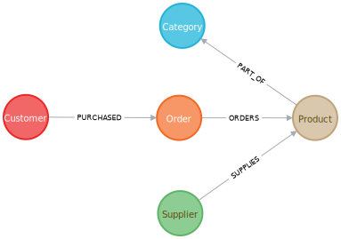

# Northwind Graph Database Documentation

## Overview
The Northwind Graph is a demonstration of migrating from a relational database to a graph database using a classic dataset. It showcases how to transform traditional relational data into a graph model with nodes and relationships.

## Data Models

### Entity Relationship Model (ERM)

*Figure 1: Entity Relationship Model showing the complete flow of relationships between Employees, Orders, Products, Categories, and Suppliers*

Key Relationships:
- Employee `:REPORTS_TO` Employee (hierarchical structure)
- Employee `:SOLD` Order (sales tracking)
- Order `:CONTAINS` Product (order details)
- Product `:PART_OF` Category (product categorization)
- Supplier `:SUPPLIES` Product (supply chain)

### Relational Schema Breakdown

#### Product, Category, and Supplier Relationships

*Figure 2: Relational schema showing the relationships between Products, Categories, and Suppliers tables*

#### Customer and Order Relationships

*Figure 3: Relational schema showing the relationships between Customers and Orders tables*

### Graph Model Transformation

*Figure 4: Neo4j Graph Model showing how the relational tables are transformed into a connected graph with nodes and relationships*

## Data Model

### Entities

1. **Products** (`:Product`)
   - Unique Identifier: `productID`
   - Key Properties:
     - `productName`
     - `unitPrice`
     - `unitsInStock`
     - `unitsOnOrder`
     - `reorderLevel`
     - `discontinued`

2. **Categories** (`:Category`)
   - Unique Identifier: `categoryID`
   - Key Properties:
     - `categoryName`
     - `description`

3. **Suppliers** (`:Supplier`)
   - Unique Identifier: `supplierID`
   - Contact Information:
     - `companyName`
     - `contactName`
     - `contactTitle`
     - `phone`
   - Address Details:
     - `address`
     - `city`
     - `region`
     - `postalCode`
     - `country`

4. **Customers** (`:Customer`)
   - Unique Identifier: `customerID`
   - Contact Information:
     - `companyName`
     - `contactName`
     - `contactTitle`
     - `phone`
   - Address Details:
     - `address`
     - `city`
     - `region`
     - `postalCode`
     - `country`

5. **Orders** (`:Order`)
   - Unique Identifier: `orderID`
   - Order Details:
     - `orderDate`
     - `requiredDate`
     - `shippedDate`
     - `shipVia`
     - `freight`
   - Shipping Information:
     - `shipName`
     - `shipAddress`
     - `shipCity`
     - `shipRegion`
     - `shipPostalCode`
     - `shipCountry`

## Graph Relationships

### Product Relationships
- `(Product)-[:PART_OF]->(Category)`: 
  - Links products to their respective categories
  - Allows easy categorization and filtering of products

- `(Supplier)-[:SUPPLIES]->(Product)`: 
  - Indicates which supplier provides a specific product
  - Enables supply chain and sourcing queries

### Order Relationships
- `(Customer)-[:PURCHASED]->(Order)`: 
  - Shows which customer made a specific order
  - Enables customer purchase history analysis

- `(Order)-[:ORDERS]->(Product)`: 
  - Represents products in an order
  - Includes quantity information
  - Allows detailed order composition analysis

## Sample Analytical Queries

### 1. Product Categories by Supplier
```cypher
MATCH (s:Supplier)-->(:Product)-->(c:Category)
RETURN s.companyName as Company, 
       collect(distinct c.categoryName) as Categories;
```

### 2. Produce Suppliers
```cypher
MATCH (c:Category {categoryName:"Produce"})<--(:Product)<--(s:Supplier)
RETURN DISTINCT s.companyName as ProduceSuppliers;
```

### 3. Total Produce Products Purchased
```cypher
MATCH (cust:Customer)-[:PURCHASED]->(:Order)-[o:ORDERS]->(p:Product),
      (p)-[:PART_OF]->(c:Category {categoryName:"Produce"})
RETURN DISTINCT cust.contactName as CustomerName, 
               SUM(o.quantity) AS TotalProductsPurchased;
```

## Data Loading Strategy

### Process
1. Load raw data from CSV files
2. Create unique constraints on key identifiers
3. Create nodes for each entity type
4. Establish relationships based on foreign key mappings

### Key Transformation Principles
- Convert foreign key references to graph relationships
- Eliminate join tables
- Create direct, traversable connections
- Maintain data integrity and queryability

## Potential Use Cases
- Supply chain analysis
- Customer purchasing behavior
- Product categorization
- Inventory management
- Sales performance tracking

## Source
[Neo4j Northwind Graph Guide](https://guides.neo4j.com/northwind/index.html)
